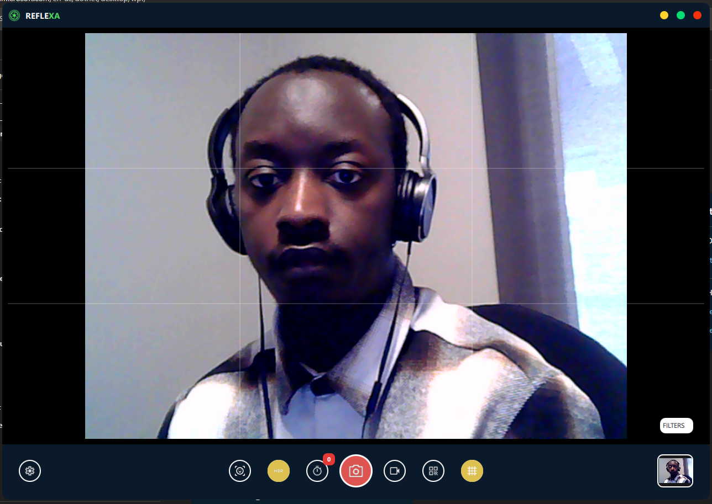
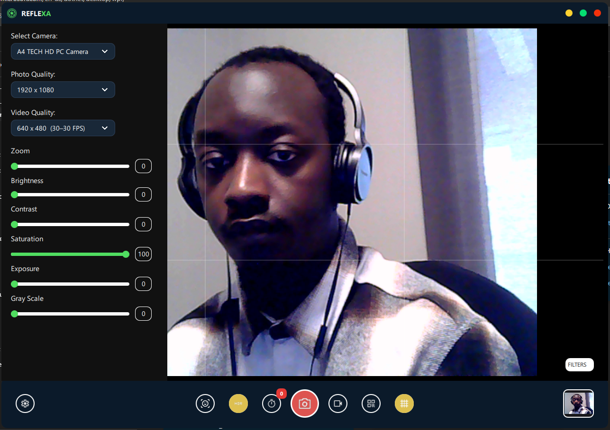
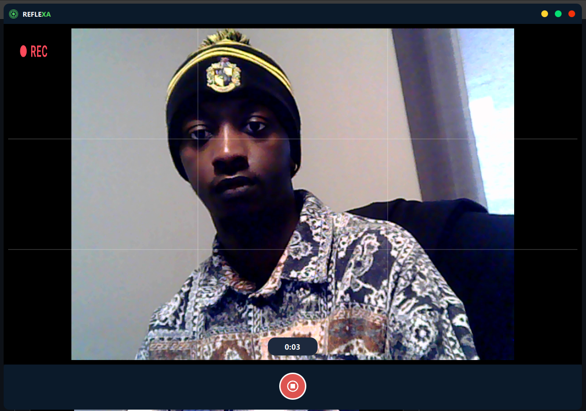
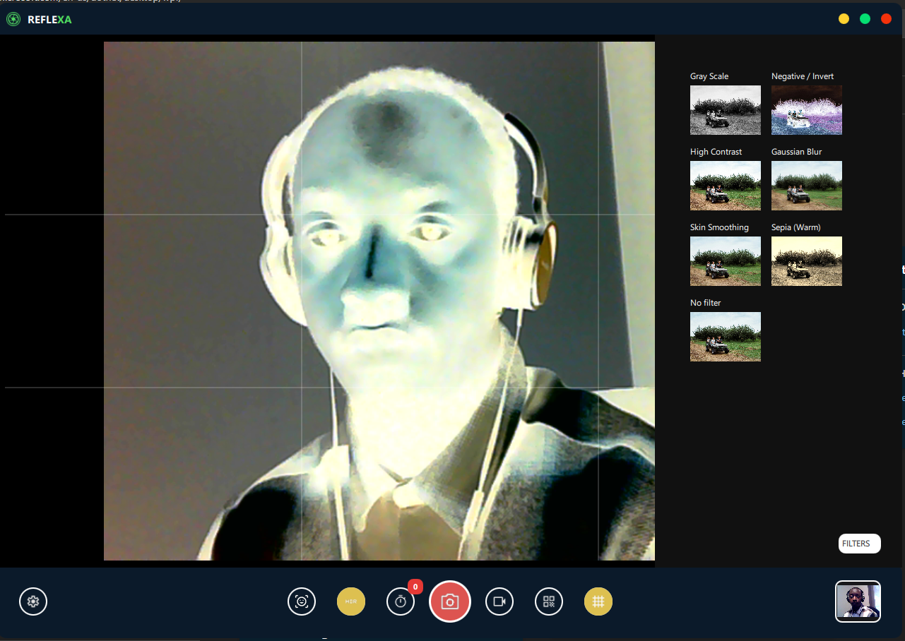
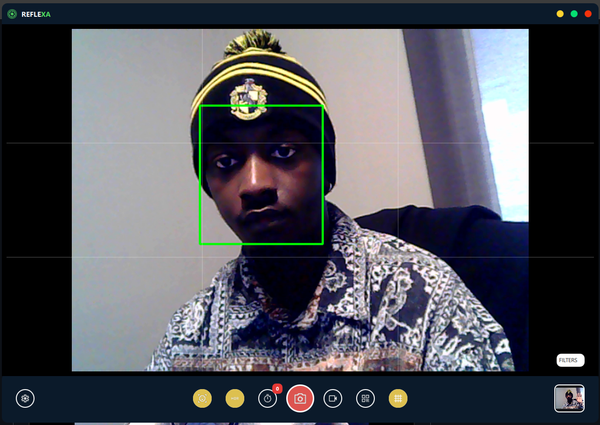
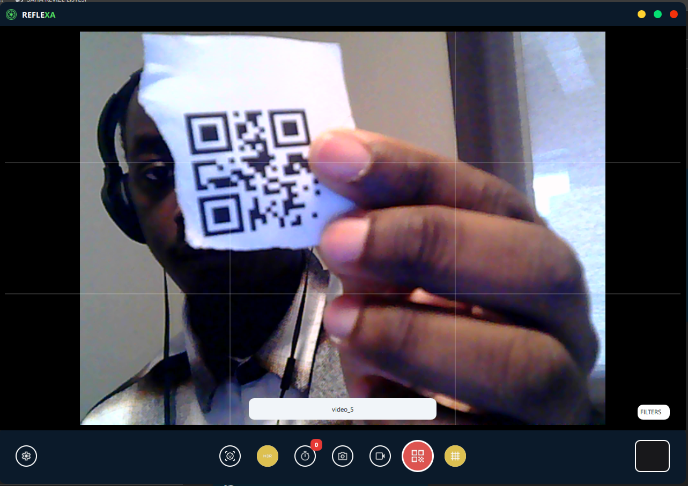

### Reflexa Camera Application

### About

This project is a feature-rich camera and media application built with Qt 6, QML, C++, and OpenCV, designed for use cases such as kiosks, photobooths, interactive displays, embedded systems or any Desktop computer.

The application provides a complete capture-to-playback workflow, combining real-time camera control, image processing, video recording, and media browsing in a clean, touch / click-friendly UI.




### Key Features

### Camera & Capture

- Switch between multiple cameras at runtime

### Live camera preview with adjustable settings:
- Zoom
- Brightness
- Contrast
- Exposure
- Grayscale



- Photo capture and video recording
- Configurable timer before taking a photo or starting video recording




### Image Processing & Filters (OpenCV)

Real-time and post-capture filters:

- Grayscale
- Skin smoothing
- Gaussian blur
- Sepia (warm)
- Invert / negative
- High contrast
- Face detection
- HDR support






Filters applied using OpenCV for performance and flexibility

### Video Playback & Media Gallery

- Reliable video playback via a C++ MediaController (QMediaPlayer)
- Play / pause controls
- Media-type–aware UI (photo vs video)
- View captured photos and recorded videos
- Smooth transitions and animations


### QR Code Scanning

- Built-in QR code scanner using the camera feed
- Suitable for check-in, authentication, or content triggering scenarios



### Technology Stack

- Qt 6
- Qt Quick (QML)
- Qt Multimedia
- C++
- QMediaPlayer
- Camera & hardware integration
- OpenCV
- Image processing
- Filters
- Face detection

### Setup & Build
### Prerequisites

Make sure the following tools and dependencies are installed:

- Qt 6.x
- Qt Quick
- Qt Multimedia
- Qt Creator
- C++ Compiler
- MSVC (Windows) or GCC/Clang (Linux)
- OpenCV

Built with the same compiler as Qt

CMake or qmake (depending on project configuration)

```bash
git clone https://github.com/Muhammedsuwaneh/reflexa-camera-app.git
cd reflexa-camera-app
```

- Open the Project
- Launch Qt Creator

Open the project using:

CMakeLists.txt or

.pro file

Configure the kit (Desktop Qt 6)

Configure OpenCV

Ensure OpenCV is properly linked:

OpenCV include and library paths must match your Qt compiler

For CMake:

```bash
find_package(OpenCV REQUIRED)
target_link_libraries(your_target PRIVATE ${OpenCV_LIBS})
```

For qmake:


```bash
INCLUDEPATH += path/to/opencv/include
LIBS += -Lpath/to/opencv/lib -lopencv_core -lopencv_imgproc -lopencv_objdetect
```

Build & Run
Select Debug or Release
Build the project
Run from Qt Creator

### Architecture Overview

- Camera and hardware logic handled in C++
- UI and interaction built with QML
- OpenCV used for real-time image processing
- Media playback managed in C++ for stability
- QML communicates with backend via exposed controllers

### Use Cases

- Photobooth systems
- Self-service kiosks
- Interactive displays
- Embedded camera applications
- R&D and prototyping projects
- Ordinary Desktop computers

### Notes

- Designed for touch screens / any desktop computer
- Optimized for long-running applications
- Video playback depends on system codec support (e.g. H.264 + AAC on Windows)

## • Version 
1.0.0

## • Licensed
Under [`MIT`](LICENSE) - Copyright 2025/2026 


